<picture>
  <source media="(prefers-color-scheme: dark)" srcset="dark.svg">
  <source media="(prefers-color-scheme: light)" srcset="light.svg">
  
</picture>

  
  
  

I am a final year BS Cyber Security student at GIKI, based in Islamabad. My work sits where governance meets engineering: I map controls to ISO 27001 and NIST, audit how organizations actually run security, and build systems that detect and deceive attackers using machine learning.

